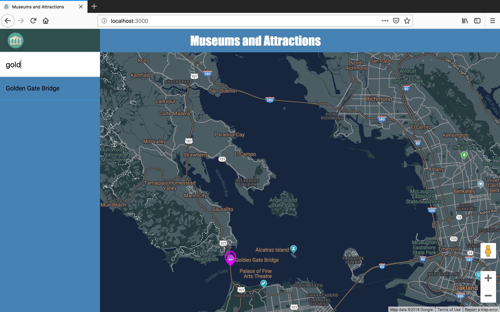
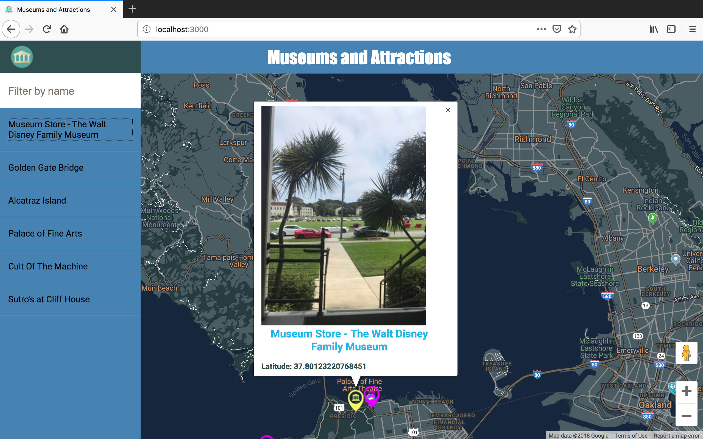
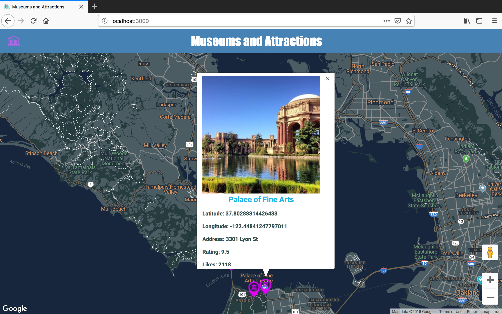

# Neighborhood Map Tips

## Project Overview

This single-page application uses React-google-maps and recompose library to render a map onscreen of a neighborhood in San Francicso, California along with 6 nearby locations to the map's center.

The page features 6 map markers of locations near you using the  **Foursquare API**  , these markers can then be clicked on to reveal further information of these nearby places including a photo and type of place. There is a side pane which lists the names of the 6 locations, each location is clickable to open its corresponding infowindow. The sidepane also has a search box to filter through only the name(s) and the corresponding map marker(s) you wish to see.

Before I start coding I read some articles about the best way to using  **Google Maps API**  with ReactJS, follow below:

-   For starter please read  [google-maps-react](https://www.npmjs.com/package/google-maps-react)
-   Also reading :  [How to Write a Google Maps React Component](https://www.fullstackreact.com/articles/how-to-write-a-google-maps-react-component/)
-   and this another one  [Implement Google Maps in ReactJs](https://getpocket.com/a/read/1918096586)
-   and more.. You can find below;

* https://devhints.io/jest
* https://babeljs.io/
* https://www.npmjs.com/package/gulp-jasmine-phantom
* https://stackoverflow.com/questions/24321307/what-is-the-difference-between-createspy-and-createspyobj
* https://stackoverflow.com/questions/32615713/tobetrue-vs-tobetruthy-vs-tobetrue
* https://stackoverflow.com/questions/35969974/foreach-is-not-a-function-error-with-javascript-array
*  https://stackedit.io/

## Technologies used:

-   ReactJs
-   HTML
-   CSS
-   Foursquare API
-   Google Maps API
-
## Getting Started

To test this App in your machine, just follow the steps below:

-   Clone this repo in your local  `git clone https://github.com/sgc88/react-neighborhood-map
-   Now into your folder project in the terminal exec  `npm install`  to install all dependencies
-   After install all dependencies just execute  `npm start`  on the terminal to launching the App in the browser.

## Offline First

-   The service worker is only enabled in the production environment. It's recommended that you do not enable an offline-first service worker in a development environment.
-   If you need to  **test your offline-first**  service worker locally, build the application (using  `npm run build`) and run a simple http server from your build directory.

